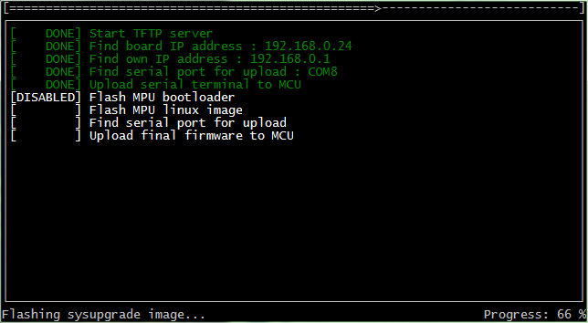

# yun-go-updater

This is slightly refactored and modified tool for uploading new system images and atmega firmwares on arduino yun compatible boards.

The tool has been upgraded with simple text ui which hides all details into log file.
The code has been refactored to put all major functions into separate files, just to ease future changes.

**This code uses [go-jobs-ui](https://github.com/mic90/go-jobs-ui)**

The example UI flow is shown below:

By default the tool will not flash the bootloader, to do it you must run the tool with 'bl' flag

Feel free to use it for your own needs, but be aware that flashing board with new firmware may brick it. 

**You do it at Your own responsibility.**
